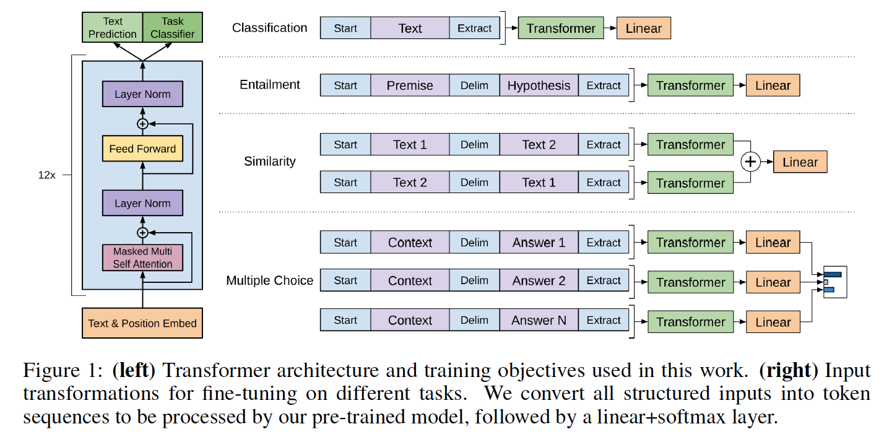

# PyTorch implementation of OpenAI's Finetuned Transformer Language Model

This is a PyTorch implementation of the [TensorFlow code](https://github.com/openai/finetune-transformer-lm) provided with OpenAI's paper ["Improving Language Understanding by Generative Pre-Training"](https://blog.openai.com/language-unsupervised/) by Alec Radford, Karthik Narasimhan, Tim Salimans and Ilya Sutskever.

This implementation comprises **a script to load in the PyTorch model the weights pre-trained by the authors** with the TensorFlow implementation.



The model classes and loading script are located in [model_pytorch.py](model_pytorch.py).

The names of the modules in the PyTorch model follow the names of the Variable in the TensorFlow implementation. This implementation tries to follow the original code as closely as possible to minimize the discrepancies.

This implementation thus also comprises a modified Adam optimization algorithm as used in OpenAI's paper with:
- fixed weights decay following the work of [Loshchilov et al.](https://arxiv.org/abs/1711.05101), and
- scheduled learning rate as [commonly used for Transformers](http://nlp.seas.harvard.edu/2018/04/03/attention.html#optimizer).

## Requirements
To use the model it-self by importing [model_pytorch.py](model_pytorch.py), you just need:
- PyTorch (version >=0.4)

To run the classifier training script in [train.py](train.py) you will need in addition:
- tqdm
- sklearn
- spacy
- ftfy
- pandas

You can download the weights of the OpenAI pre-trained version by cloning [Alec Radford's repo](https://github.com/openai/finetune-transformer-lm) and placing the `model` folder containing the pre-trained weights in the present repo.

## Using the pre-trained model as a Transformer Language Model
The model can be used as a transformer language model with OpenAI's pre-trained weights as follow:
```python
from model_pytorch import TransformerModel, load_openai_pretrained_model, DEFAULT_CONFIG

args = DEFAULT_CONFIG
model = TransformerModel(args)
load_openai_pretrained_model(model)
```

This model generates Transformer's hidden states. You can use the `LMHead` class in [model_pytorch.py](model_pytorch.py) to add a decoder tied with the weights of the encoder and get a full language model. You can also use the `ClfHead` class in [model_pytorch.py](model_pytorch.py) to add a classifier on top of the transformer and get a classifier as described in OpenAI's publication. (see an example of both in the `__main__` function of [train.py](train.py))

To use the positional encoder of the transformer, you should encode your dataset using the `encode_dataset()` function of [utils.py](utils.py). Please refer to the beginning of the `__main__` function in [train.py](train.py) to see how to properly define the vocabulary and encode your dataset.

## Fine-tuning the pre-trained model on a classification task
This model can also be integrated in a classifier as detailed in [OpenAI's paper](https://blog.openai.com/language-unsupervised/). An example of fine-tuning on the ROCStories Cloze task is included with the training code in [train.py](train.py)

The ROCStories dataset can be downloaded from the associated [website](http://cs.rochester.edu/nlp/rocstories/).

As with the [TensorFlow code](https://github.com/openai/finetune-transformer-lm), this code implements the ROCStories Cloze Test result reported in the paper which can be reproduced by running:

```bash
python -m spacy download en
python train.py --dataset rocstories --desc rocstories --submit --analysis --data_dir [path to data here]
```

#### First experiments on the ROCStories test set
Finetuning the PyTorch model for 3 Epochs on ROCStories takes 10 minutes to run on a single NVidia K-80.

The single run test accuracy of this PyTorch version is 85.84%, while the authors reports a median accuracy with the TensorFlow code of 85.8% and the paper reports a best single run accuracy of 86.5%.

The authors implementations uses 8 GPU and can thus accomodate a batch of 64 samples while the present implementation is single GPU and is in consequence limited to 20 instances on a K80 for memory reasons. In our test, increasing the batch size from 8 to 20 samples increased the test accuracy by 2.5 points. A better accuracy may be obtained by using a multi-GPU setting (not tried yet).

The previous SOTA on the ROCStories dataset is 77.6% ("Hidden Coherence Model" of Chaturvedi et al. published in "Story Comprehension for Predicting What Happens Next" EMNLP 2017, which is a very nice paper too!)
